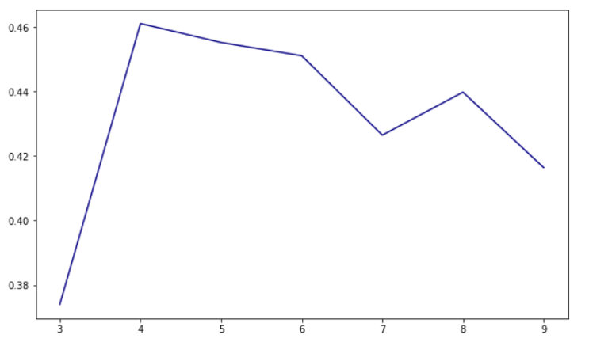
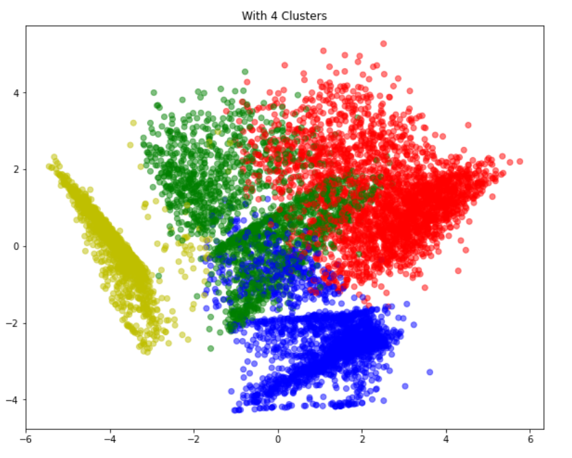

# Credit Card Customers Segmentation

## Problem Statement
<b style="color: #fff; background: #333; padding: 3px;">To develop a customer segmentation to define marketing strategy.</b>

### Why Segmentation of Customers?
**Customer segmentation is necessary. You can’t serve every customer the same product, experience, or ad as they won’t resonate with it the same. Doing so results in low-click through rate, engagement, and conversions. 
That’s where segmenting comes into the picture. Finding all of the unique groups that make up a bigger customer base lets you get into customer’s heads and give them exactly what they want, improving their experience and boosting revenue.**

### KMeans Clustering
**Used Silhouette Scores as metric to validate performance of various clusters** 

 
Based on the graph above, it is clear that 4 clusters are showing better distinguised characteristics among the group of customers.

**Distribution with 4 Clusters** 

